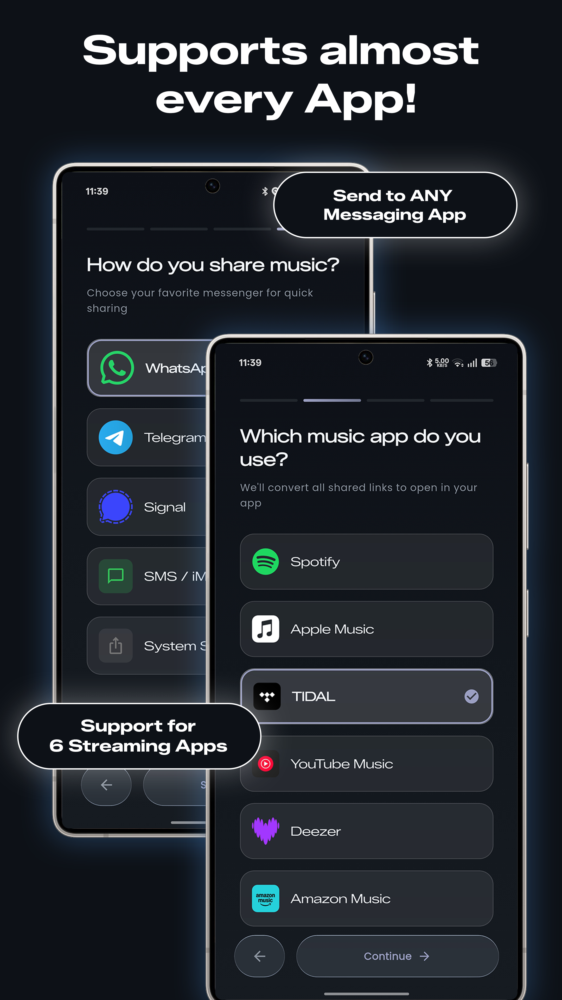
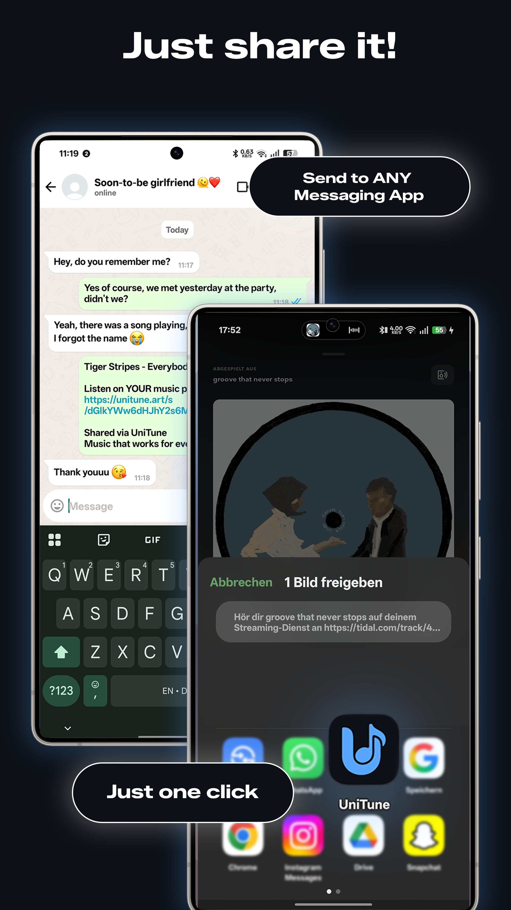
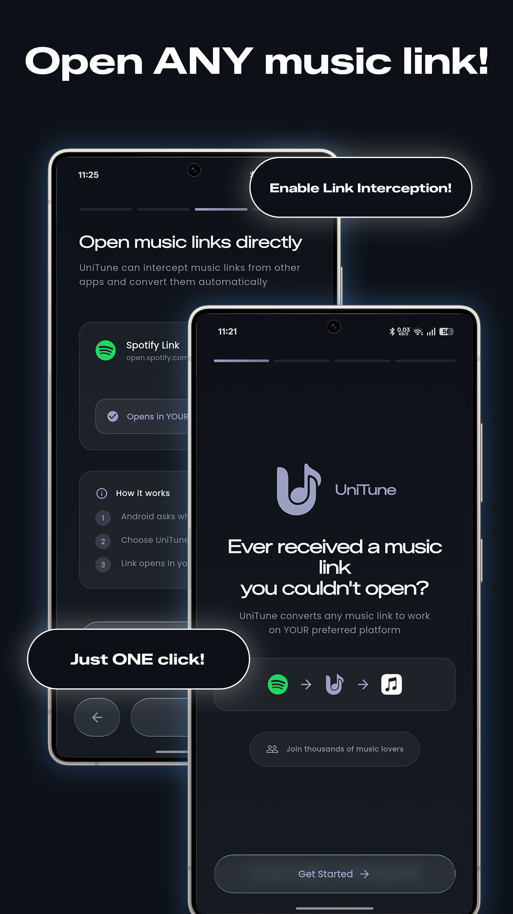
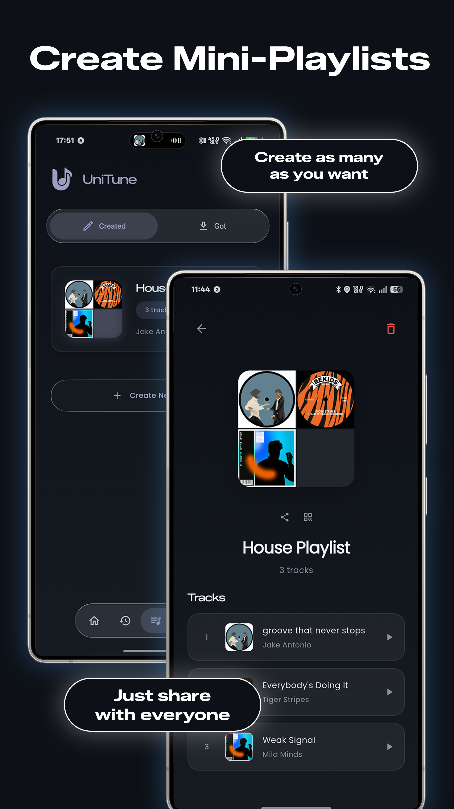

<div align="center">
  
  
  # UniTune
  
  **Universal Music Link Sharing**
  
  [Official Website](https://unitune.art/) • [Features](#key-features) • [Screenshots](#screenshots) • [Download ](#download--install)
  
  Share your favorite music across all streaming platforms with a single tap
  
  [](https://www.gnu.org/licenses/agpl-3.0)
  [](https://flutter.dev)
  [](https://github.com/FlazeIGuess/unitune/actions)
  [](https://github.com/FlazeIGuess/unitune/releases)

  [](https://github.com/FlazeIGuess/unitune/releases/latest)
</div>

---

## What is UniTune?

UniTune eliminates the frustration of incompatible music links. When a friend shares a Spotify link but you use Apple Music, UniTune instantly converts it to your preferred platform. Built with Flutter and featuring a glass design, UniTune makes cross-platform music sharing effortless while keeping your data completely private.

## Screenshots

<div align="center">
<table>
<tr>
  <td align="center"><br/><sub>Pick your platform</sub></td>
  <td align="center"><br/><sub>One-tap sharing</sub></td>
  <td align="center"><br/><sub>Link Interception</sub></td>
  <td align="center"><br/><sub>Mini Playlists</sub></td>
</tr>
</table>
</div>

> **Interested in testing UniTune?** We are currently looking for beta testers on Android.
> Apply here: [https://forms.gle/k2HPCNpEYtdeVZpz5](https://forms.gle/k2HPCNpEYtdeVZpz5)

## Key Features

### Universal Link Conversion
Paste any music link and UniTune converts it to all supported platforms in one request. Supports tracks, albums, artists, and playlists across Spotify, Apple Music, YouTube Music, Deezer, TIDAL, and Amazon Music.

### One-Tap Sharing to Friends
Hit share inside Spotify, Tidal, or any other streaming app, pick UniTune from the share sheet, and it converts the link and forwards it to your contact in a single flow. No copy-pasting, no app switching.

### Music Link Interception (Android)
Set UniTune as the default handler for music links on Android. When someone sends you a Spotify link in WhatsApp or anywhere else, tapping it opens the song directly in your preferred music app automatically.

### Mini Playlists
Build cross-platform playlists of 3 to 10 tracks from any streaming service. Share them as a single UniTune link or as a QR code with a visual share card. Anyone who opens the link can play each track on whichever service they use.

### Privacy-First Architecture
No accounts, no login, no analytics. All data stays on your device. The only outbound request is to the conversion API.

### Ads & Why They Exist
UniTune shows ads via Google AdMob. The app relies on a self-hosted backend that performs all music link conversions. Running that backend has real infrastructure costs. Ads are the way to cover those costs and keep the app free. No ad data is linked to your identity, and no personal information leaves your device.

### Dynamic Color Theming
Album artwork automatically influences the entire app color scheme for every song you open. Every conversion looks different.

### History & Analytics
Full history of converted links with statistics on platform usage, sharing frequency, and trends over adjustable time periods.

### Modern Glass Design
Glassmorphism UI with smooth animations throughout every screen, consistent with modern Android and iOS design language.

## Supported Platforms

<table>
<tr>
<td width="33%" valign="top">

### Music Services

| Platform | Status |
|----------|--------|
| Spotify | ✓ Supported |
| Apple Music | ✓ Supported |
| YouTube Music | ✓ Supported |
| Deezer | ✓ Supported |
| TIDAL | ✓ Supported |
| Amazon Music | ✓ Supported |

</td>
<td width="33%" valign="top">

### Sharing Channels

| Channel | Status |
|---------|--------|
| WhatsApp | ✓ Supported |
| Telegram | ✓ Supported |
| Signal | ✓ Supported |
| SMS / iMessage | ✓ Supported |
| System Share | ✓ Supported |

</td>
<td width="33%" valign="top">

### Content Types

| Type | Status |
|------|--------|
| Tracks | ✓ Supported |
| Albums | ✓ Supported |
| Artists | ✓ Supported |
| Playlists | ✓ Supported |
| Mini Playlists | ✓ Supported |
| QR Code Share | ✓ Supported |

</td>
</tr>
</table>

## Getting Started

### Download & Install

<table>
<tr>
<td width="25%"><strong>Platform</strong></td>
<td width="50%"><strong>Download</strong></td>
<td width="25%"><strong>Requirements</strong></td>
</tr>
<tr>
<td>Android</td>
<td><a href="https://github.com/FlazeIGuess/unitune/releases">GitHub Releases (APK)</a></td>
<td>Android 5.0+</td>
</tr>
<tr>
<td>iOS</td>
<td>Coming Soon</td>
<td>iOS 12.0+</td>
</tr>
<tr>
<td>F-Droid</td>
<td>Coming Soon</td>
<td>-</td>
</tr>
<tr>
<td>Google Play</td>
<td>Coming Soon</td>
<td>-</td>
</tr>
<tr>
<td>App Store</td>
<td>Coming Soon</td>
<td>-</td>
</tr>
</table>

### Quick Start

1. Download the latest APK from [GitHub Releases](https://github.com/FlazeIGuess/unitune/releases/latest) and install it
2. Open the app and complete the onboarding flow
3. Select your preferred music streaming service
4. Choose your favorite messaging apps for sharing
5. On Android: enable Music Link Interception in the onboarding step or later in Settings
6. Start converting and sharing music links

## Development Setup

### Prerequisites

| Tool | Version | Purpose |
|------|---------|---------|
| Flutter SDK | 3.27.1+ | Framework |
| Dart SDK | 3.10.7+ | Language |
| Android Studio | Latest | Android development |
| Xcode | Latest | iOS development (macOS only) |

### Local Development

```bash
# Clone the repository
git clone https://github.com/FlazeIGuess/unitune.git
cd unitune/unitune-app

# Install dependencies
flutter pub get

# Generate code (Riverpod)
flutter pub run build_runner build --delete-conflicting-outputs

# Run the app in debug mode
flutter run

# Run with specific device
flutter run -d <device-id>
```

### Building for Production

```bash
# Android APK (for direct distribution)
flutter build apk --release

# Android App Bundle (for Google Play Store)
flutter build appbundle --release

# iOS (macOS only, requires Apple Developer account)
flutter build ios --release

# Generate app icons
flutter pub run flutter_launcher_icons
```

### Code Generation

UniTune uses code generation for Riverpod providers:

```bash
# Watch mode (auto-regenerate on changes)
flutter pub run build_runner watch

# One-time generation
flutter pub run build_runner build --delete-conflicting-outputs
```

## Technical Architecture

### Project Structure

```
lib/
├── core/                    # Shared foundation
│   ├── ads/                # AdMob configuration and helpers
│   ├── animations/         # Page transitions, fade effects
│   ├── constants/          # Service definitions, app constants
│   ├── security/           # URL validation, input sanitization
│   ├── theme/              # Dynamic theming, color extraction
│   ├── utils/              # Helpers, logging, responsive utilities
│   └── widgets/            # Reusable UI components (glass, buttons)
│
├── data/                    # Data layer
│   ├── models/             # Data models (HistoryEntry, MiniPlaylist, etc.)
│   └── repositories/       # Data access (History, Cache, Playlists, API)
│
└── features/                # Feature modules
    ├── home/               # Main conversion screen with smart paste
    ├── history/            # Sharing history & statistics
    ├── playlists/          # Mini Playlists (create, QR, import, share)
    ├── settings/           # App preferences & configuration
    ├── onboarding/         # First-run experience incl. link interception step
    └── sharing/            # Share intent handling & processing screen
```

### Technology Stack

| Category | Technology | Purpose |
|----------|-----------|---------|
| Framework | Flutter 3.27.1 | Cross-platform UI |
| Language | Dart 3.10.7 | Programming language |
| State Management | Riverpod 2.6.1 | Reactive state management |
| Navigation | GoRouter 14.8.1 | Declarative routing & deep links |
| Local Storage | SharedPreferences 2.3.5 | Persistent key-value storage |
| Networking | HTTP 1.3.0 | API communication |
| UI Effects | Glass Renderer 0.2.0 | Glassmorphism effects |
| Charts | FL Chart 0.69.0 | Statistics visualization |
| Color Extraction | Palette Generator 0.3.3 | Dynamic theming from images || QR Codes | qr_flutter 4.1.0 | Playlist QR code generation |
| Screenshots | screenshot 3.0.0 | Widget-to-image for share cards |
| Image Processing | image 4.1.7 | Cover art collage generation |
| Monetization | Google Mobile Ads 5.2.0 | AdMob integration |
### Design Patterns

- **Feature-First Architecture**: Organized by features rather than layers
- **Repository Pattern**: Abstracted data access layer
- **Provider Pattern**: Riverpod for dependency injection and state
- **Responsive Design**: Adaptive layouts for different screen sizes
- **Dynamic Theming**: Runtime color scheme generation from album art

## Privacy & Security

UniTune is built with privacy as a core principle:

### Data Storage
- **100% Local Storage**: All data remains on your device
- **No Cloud Sync**: No external servers store your information
- **No User Accounts**: No registration or authentication required
- **No Tracking**: Zero analytics, telemetry, or usage tracking

### Security Measures
- **URL Validation**: All input URLs are validated and sanitized
- **Secure Communication**: HTTPS-only API communication
- **No Data Collection**: We don't collect, store, or share any user data
- **Open Source**: Fully auditable codebase under AGPL-3.0

### Permissions

| Permission | Purpose | Required |
|------------|---------|----------|
| Internet | Convert music links via API | Yes |
| Query Installed Apps | Detect available music/messaging apps | Yes |
| Read/Write Storage | Save sharing history locally | Yes |

UniTune requests only essential permissions and never accesses sensitive data like contacts, location, or camera.

## Contributing

We welcome contributions from the community! Whether you're fixing bugs, adding features, or improving documentation, your help is appreciated.

### How to Contribute

1. **Fork the Repository**: Create your own fork of the project
2. **Create a Branch**: `git checkout -b feature/your-feature-name`
3. **Make Changes**: Implement your feature or fix
4. **Test Thoroughly**: Ensure all existing tests pass and add new ones
5. **Follow Style Guidelines**: Use Flutter/Dart conventions
6. **Commit Changes**: Write clear, descriptive commit messages
7. **Push to Fork**: `git push origin feature/your-feature-name`
8. **Open Pull Request**: Submit a PR with detailed description

### Development Guidelines

- Follow Flutter and Dart style guidelines
- Write unit tests for new features
- Update documentation for API changes
- Ensure CI/CD checks pass
- Use English for all code, comments, and documentation
- No emojis in code or documentation (use icons where appropriate)
- Maintain the glass design language

### Code Style

```dart
// Good: Clear naming, proper formatting
Future<List<HistoryEntry>> fetchHistory({
  required int limit,
  DateTime? startDate,
}) async {
  // Implementation
}

// Bad: Unclear naming, poor formatting
Future<List<HistoryEntry>> getStuff(int l,DateTime? d)async{
  // Implementation
}
```

### Reporting Issues

Found a bug or have a feature request? Open an issue on GitHub with:
- Clear description of the problem or feature
- Steps to reproduce (for bugs)
- Expected vs actual behavior
- Device and OS version
- Screenshots or logs (if applicable)

## Related Projects

- [unitune-api](https://github.com/FlazeIGuess/unitune-api) - Backend API for link conversion
- [unitune-worker](https://github.com/FlazeIGuess/unitune-worker) - Cloudflare Worker for web interface

## License

This project is licensed under the GNU Affero General Public License v3.0 (AGPL-3.0).

See [LICENSE](LICENSE) for details.

### Attribution Requirement
Any use, modification, or distribution of this software must include proper attribution to the original author and project.

## Acknowledgments

- Music link conversion powered by custom API
- UI design inspired by modern glassmorphism trends
- Built with Flutter and Riverpod

## Support the Project

UniTune is free and open source. If you find it useful, consider supporting development to help cover infrastructure costs and the Apple Developer fee for the upcoming iOS release.

[](https://ko-fi.com/unitune)

**Want to test the beta?** Apply here: [Beta Tester Form](https://forms.gle/k2HPCNpEYtdeVZpz5)

### Other Support Channels

- **Issues**: [GitHub Issues](https://github.com/FlazeIGuess/unitune/issues)
- **Discussions**: [GitHub Discussions](https://github.com/FlazeIGuess/unitune/discussions)

---

Made with care by [FlazeIGuess](https://github.com/FlazeIGuess)
